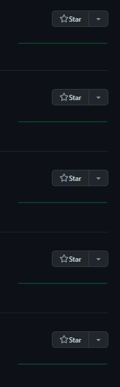

#### Hey, want to know a secret? 

This website was written using gatsbyjs and react. It can be clunky.
There were points where making changes to this site were a pain to learn. I had to get an idea of
how to actually use graphql. Getting images/youtube videos in an article to load the way I wanted them to,
adding functionality like menu filtering, changing coloring/accents, adding a header, all of those things
probably could have been easier if I were using a product other than gatsbyjs. It's an ok solution, but if
you're wanting to make a blog that people actually can find and read (and that you can upload articles to
comfortably), then you should probably just use wordpress. Or squarespace, or some other prebuilt project.
But that's the thing. Fullreset.net isn't here, on the web, because I even expect people to read it. If
a few people here and there stop by that's nice, but it's not why any of this is around. It's a learning project.
I wanted to prove to myself that I could do everything that I had to do to get this site up and running.
I wanted to learn to use tailwindcss and play with it even though there's a lot of vanilla styling css on this backend.
I wanted to go through the process of registering a custom domain because that stuff is neat, and frankly way easier
than one might expect. Did you know that hosting a site to a custom domain, registering an ssl certificate, and
actually getting something to the internet is actually COMPLETELY FREE? Isn't that crazy? I got to learn it all
by making this, and that's the point of it.

#### If you're reading this you probably got here from my github. 

You probably browse around other repos too, maybe not
even just those from your work or projects that you know other people from. One thing that I highly recommend doing
is looking around at what other people in other projects are doing. Just take a look around. You'll find lots of
different types of profiles out there. Some people are freaks. Some people create useful tools with tons of stars
on githubs that people actually use. If you go to the page of your favorite framework or a major, important tool
or package manager, you'll see that some of the main contributors are out there making important things every day
for people. This is not you. This is not the average dude. This isn't even the average software developer. Most
pages look more like this: 

This is just a dude I happened to find
while looking around. Honestly I don't even remember how I found them. They have a lot of projects started but
not many contributions to those projects. This is most of github. This is what most repos look like. I've been
thinking about how to create a project that people actually get value out of, and that's ok. It's useful.
In my family we've had a saying that "Anything's a joke as long as it's funny to one person". I like that
sentiment generally and I think it applies here. If you can find value out of your project and leverage getting
something later out of it that's good enough.
So get out there, make something to learn. It's worth it.

